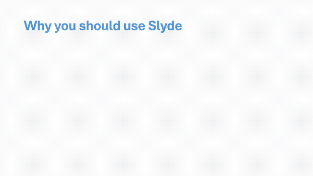

# Basics

to get started make a file called `slyde.xml`, and put in the following text:

```XML
<presentation title="My First Slyde Presentation">
</presentation>
```

Slyde is made out of XML blocks denoted like this `<tag>...</tag>`. They are an abstract way to represent data in this case a presentation. Google `XML` to learn more if you're not familiar. The first tag you'll need to use is the `<presentation> ... </presentation>` tag. 

Now in the presentation block you can add slides as you please. Add one and optionally give it a title:

```XML
<presentation title="My First Slyde Presentation">
  <slide title="Why you should use Slyde">
  </slide>
</presentation>
```

Slide blocks should always be at the 2nd level. To add text to a slide add 3rd level blocks like `<text>...</text>`, `<point>....</point>`, or `<image/>`:

```XML
<presentation title="My First Slyde Presentation">
  <slide title="Why you should use Slyde">
    <point>It is super fast and easy to make slides</point>
    <point>The animations are gorgeous!</point>
    <point>Recipient only needs a browser to open it</point>
  </slide>
</presentation>
```

To style text add [markup](./markup.md). For more information about how markup works in Slyde see [the page on markup](./markup.md)

```XML
<presentation title="My First Slyde Presentation" by="Tygo van den Hurk">
  <slide title="Why you should use Slyde">
    <point>It is super **fast and easy** to make slides</point>
    <point>The animations are **gorgeous**!</point>
    <point>Recipient only needs a browser to open it</point>
  </slide>
</presentation>
```

This would output the following fully animated presentation:



You can optionally add presentor notes using XML comments `<!-- ... -->`:

```XML
<presentation title="My First Slyde Presentation" by="Tygo van den Hurk">
  <slide title="Why you should use Slyde">
    <!-- These are my slide notes in case I forget what to say -->
    <point>It is super **fast and easy** to make slides</point>
    <point>The animations are **gorgeous**!</point>
    <point>Recipient only needs a browser to open it</point>
  </slide>
</presentation>
```
