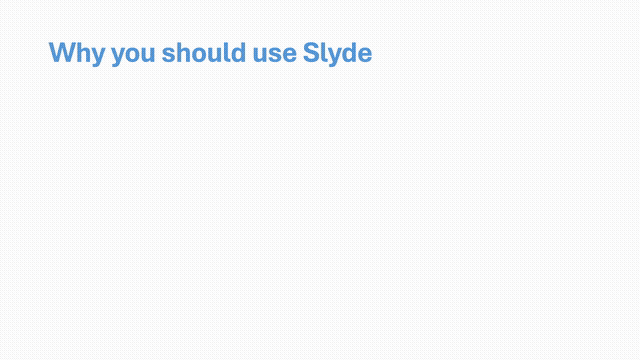

<div align="center">
  <picture>
    <source srcset="./assets/logo-standalone.svg" media="(max-width: 600px)">
    
  </picture>
  <br>
  <br>
  <p>Make beautifully animated Slydes and presentations from XML with ease! </p>
</div>

## What is Slyde?

Slyde is a program to create professional beautifully animated presentations from XML. It is fast and easy, even for non-technical people. [See the basics](./basics.md) to get started.

```XML
<presentation title="My First Slyde Presentation" by="Tygo van den Hurk">
  <slide title="Why you should use Slyde">
    <!-- These are my slide notes in case I forget what to say -->
    <point>It is super **fast and easy** to make slides</point>
    <point>The animations are **gorgeous**!</point>
    <point>Recipient only needs a browser to open it</point>
  </slide>
</presentation>
```

This would output the following fully animated presentation:



To see a run down of how we made this slide [see the basics](./basics.md).
